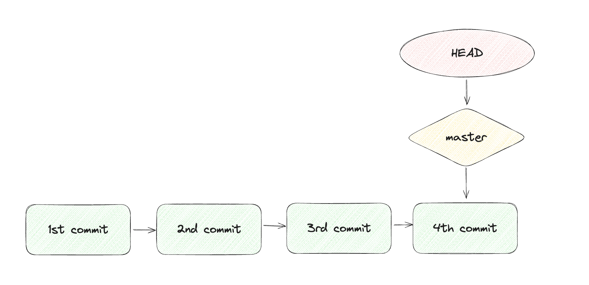

## HEAD

- 현재 branch를 가리키는 포인터
- 마지막 commit 스냅샷
- 다음 commit의 부모 commit
- 항상 현재 브랜치의 최신 commit을 포인팅함
- working directory의 내부는 HEAD가 가리키는 commit에 따라 다르게 구성됨
- `HEAD^` : 현재 HEAD가 가리키고 있는 commit의 바로 이전 commit
- `HEAD~n` : 현재 HEAD가 가리키는 commit보다 n단계 전에 있는 commit

## HEAD와 branch의 관계

- HEAD : 어떤 commit을 branch를 통해 간접적으로 가리키는 존재
- branch : 어떤 commit을 가리키는 존재
- `git reset` : HEAD가 가리키던 branch를 조정
- `git checkout` : HEAD 자체를 조정
- detached HEAD : HEAD가 branch가 아닌 commit을 직접 가리키며, 과거의 특정 commit에서 새로운 branch를 만들고 싶을 때 사용

## `git reset` 옵션에 따른 HEAD, repository, staging area, working directory

| option | working directory  | staging area       | repository              |
| ------ | ------------------ | ------------------ | ----------------------- |
| —soft  | 변화 없음          | 변화 없음          | HEAD가 이전 커밋 가리킴 |
| —mixed | 변화 없음          | 이전 커밋처럼 바뀜 | HEAD가 이전 커밋 가리킴 |
| —hard  | 이전 커밋처럼 바뀜 | 이전 커밋처럼 바뀜 | HEAD가 이전 커밋 가리킴 |

---

### 레퍼런스

1. [https://git-scm.com/book/ko/v2/Git-도구-Reset-명확히-알고-가기](https://git-scm.com/book/ko/v2/Git-%EB%8F%84%EA%B5%AC-Reset-%EB%AA%85%ED%99%95%ED%9E%88-%EC%95%8C%EA%B3%A0-%EA%B0%80%EA%B8%B0)
2. https://www.codeit.kr/topics/git/lessons/2928
