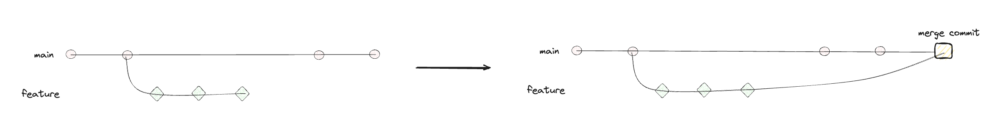

## 1. Create a merge commit

- `두 branch의 변경 사항을 모두 유지하면서 merge`
- 각 branch의 변경 사항이 과거의 commit으로 보존되고, 새로운 commit이 추가되어 최종 merge
- 장점
    - branch의 히스토리를 모두 유지함 → 프로젝트의 진행 상황을 명확하게 이해 및 추적 가능
    - commit 아이디가 유지됨
- 단점
    - commit 히스토리가 복잡해질 수 있음

## 2. Squash and merge

- `branch에서의 모든 변경 사항을 하나의 commit으로 압축하여 merge`
- 각각의 commit에서 발생한 모든 변경 사항을 merge한 후, 하나의 새로운 commit을 생성함
- 장점
  - 간단한 commit 히스토리
    - 각 commit이 특정 PR을 대변하여 의미를 이해하기 쉬워짐
    - PR에서 발생한 작은 문제들을 숨기고, 그 PR에서 가장 중요하고 필요했던 내용들만 압축하여 담게 됨
- 단점
  - 작업의 상세 이력 사라짐 → 추후 문제 해결 어려워질 수 있음
  - 기존 작업 commit 아이디들이 하나로 합쳐지며 사라지고 새로운 commit 아이디 생성
    → 여러 명이 하나의 branch로 작업하고 있었다면 복잡한 문제 발생 가능
    → GitHub에서 확인 가능

## 3. Rebase and merge

- `현재 branch를 target branch에 rebase시킨 후 merge`
- target branch의 commit위로 현재 branch의 모든 commit을 옮겨 놓는 것과 같음
- 장점
  - 깨끗하고 선형적인 commit 히스토리 → 히스토리 파악 및 코드 변화 이해 쉬움
- 단점
  - 관련된 커밋의 id들이 모두 바뀜 → branch가 크게 분기된 경우 어려울 수 잇음
  - PR 별로 다른 기능으로 나뉘어 있던 작업 이력이 하나의 선형적인 히스토리로 합쳐짐 →특정 기능이 어디서부터 어디까지의 commit으로 구현되었는지 알기 어려워짐

---

### 참고 자료

1. https://www.codeit.kr/topics/sp-development-collaboration/lessons/6560
